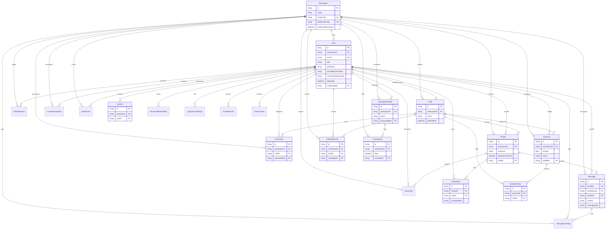

# Coparentes — struktura bazy danych i ERD

Źródło: `coparentes-backend-main/prisma/schema.prisma` (PostgreSQL).  
Wygenerowano: 2026-10-07. Tylko dokumentacja — bez zmian w kodzie.

## Spis obiektów (modele)

| Model | Opis |
|-------|------|
| Workspace | Przestrzeń rodziny; `inviteCode`, `childInviteCode` |
| User | Konto (rodzic / dziecko / obserwator); soft-delete `deletedAt` |
| UserConsent | Audyt zgód RODO (append-only) |
| Child | Profil dziecka w workspace |
| Document | Sejf dokumentów |
| Session | Token sesji API (hash) |
| PasswordResetToken | Reset hasła (hash) |
| Thread | Wątek czatu |
| ThreadKey | E2E: klucz wątku sealed dla usera |
| Message | Wiadomość |
| MessageUserTag | Prywatny tag usera na wiadomości |
| ExportJob | Eksport dowodów |
| LoginOtpChallenge | OTP po logowaniu |
| TrustedDevice | Zaufane urządzenie (skip OTP) |
| EmailInvite | Zaproszenie e-mail |
| CustodySlot | Dzień opieki |
| CustodySchedule | Harmonogram opieki |
| CustodyException | Wyjątek od harmonogramu |
| CalendarEvent | Wydarzenie kalendarza |
| SwapRequest | Prośba o zamianę dnia |
| Expense | Wydatek |
| ExpenseChild | M:N wydatek ↔ dzieci |

## Enumy

| Enum | Wartości |
|------|----------|
| UserRole | parentA, parentB, child, observer |
| EmailInviteStatus | PENDING, ACCEPTED, EXPIRED |
| MessageTone | neutral, tense, aggressive, positive |
| ExportType | messages, calendar, finances, fullPack |
| ExportStatus | pending, processing, completed, failed |
| CalendarEventType | school, medical, activity, handover, holiday, other |
| SwapStatus | pending, accepted, rejected, counterProposed |
| CustodySchedulePattern | weekAlternating, everyOtherWeekend, customWeek |
| CustodyScheduleStatus | draft, pendingApproval, active, superseded |
| CustodySlotSource | schedule, exception, manual, swap |
| CustodyExceptionType | singleDay, range, holiday |
| CustodyExceptionStatus | pending, accepted, rejected |
| ExpenseStatus | pending, accepted, disputed, settled |
| ThreadAudience | parents, family |
| ConsentType | TERMS, DATA_PROCESSING, CHILD_DATA, EMAIL_NOTIFICATIONS, MARKETING, ANALYTICS |

## Pola modeli (skrót)

### Workspace
`id` PK · `name` · `inviteCode` UNIQUE · `childInviteCode` UNIQUE · `inviteCodeExpiresAt?` · `createdAt` · `updatedAt`

### User
`id` PK · `workspaceId?` → Workspace · `name` · `email` UNIQUE · `passwordHash` · `publicKey?` · `privateKeyEnvelope?` · `recoveryKeyEnvelope?` · `role` · `twoFactorEnabled` · `highConflictMode` · `mustChangePassword` · `themeMode` · `colorScheme` · `deletedAt?` · `childProfileId?` UNIQUE → Child · `createdAt` · `updatedAt`

### Child
`id` PK · `workspaceId` → Workspace · `name` · `dateOfBirth` · `school?` · `createdAt`

### Thread / ThreadKey / Message
- **Thread:** `workspaceId`, `subject`, `category`, `childId?`, `createdById`, `audience`, `isSystemChannel`, …
- **ThreadKey:** UNIQUE(`threadId`,`userId`), `encryptedKey`
- **Message:** `threadId`, `workspaceId`, `senderId`, `content`, `messageType`, `tone`, `hash`, …

### Finanse / kalendarz / opieka
- **Expense** + **ExpenseChild** (M:N)
- **CalendarEvent**, **SwapRequest**
- **CustodySchedule** → **CustodySlot**; **CustodyException**

### Auth / bezpieczeństwo
Session, PasswordResetToken, LoginOtpChallenge, TrustedDevice, EmailInvite, UserConsent

## Relacje kluczowe

```
Workspace 1──* User
Workspace 1──* Child
User 0..1──0..1 Child          (linkedAccount / childProfileId)
Workspace 1──* Thread 1──* Message
Thread 1──* ThreadKey *──1 User
Expense *──* Child             (przez ExpenseChild)
Workspace CASCADE: większość encji znika z przestrzenią
```

## Diagram ERD (Mermaid)



## Pełna lista pól (tabele)

### Workspace
| Pole | Typ | Uwagi |
|------|-----|--------|
| id | String | PK, cuid |
| name | String | |
| inviteCode | String | unique |
| childInviteCode | String | unique |
| inviteCodeExpiresAt | DateTime? | |
| createdAt / updatedAt | DateTime | |

### User
| Pole | Typ | Uwagi |
|------|-----|--------|
| id | String | PK |
| workspaceId | String? | FK → Workspace, onDelete Cascade |
| name, email, passwordHash | String | email unique |
| publicKey, privateKeyEnvelope, recoveryKeyEnvelope | String? | E2E |
| role | UserRole | default parentA |
| twoFactorEnabled, highConflictMode, mustChangePassword | Boolean | |
| themeMode, colorScheme | String | |
| deletedAt | DateTime? | soft-delete |
| childProfileId | String? | unique FK → Child |
| createdAt / updatedAt | DateTime | |

### UserConsent
id · userId · consentType · granted · grantedAt · ipAddressHash · consentVersion · revokedAt? · createdAt

### Child
id · workspaceId · name · dateOfBirth · school? · createdAt

### Document
id · workspaceId · title · category · childId? · fileName? · mimeType? · fileUrl? · contentBase64? · sizeBytes · uploadedById · createdAt · updatedAt

### Session
id · tokenHash (unique) · userId · createdAt · expiresAt

### PasswordResetToken
id · tokenHash (unique) · userId · createdAt · expiresAt · usedAt?

### Thread
id · workspaceId · subject · category · childId? · createdById · createdAt · lastActivity · audience · isSystemChannel

### ThreadKey
id · threadId · userId · encryptedKey · createdAt · UNIQUE(threadId, userId)

### Message
id · threadId · workspaceId · senderId · senderName · content · messageType · tone · sentAt · isDelivered · isRead · hash · attachmentsJson?

### MessageUserTag
id · workspaceId · userId · messageId · threadId · tag · createdAt · UNIQUE(userId, messageId, tag)

### ExportJob
id · workspaceId · requestedById · type · threadId? · fromDate · toDate · status · downloadUrl? · manifestHash? · payloadJson · expiresAt? · createdAt

### LoginOtpChallenge
id · userId · codeHash · expiresAt · used · failedAttempts · lastSentAt · createdAt

### TrustedDevice
id · userId · tokenHash · expiresAt · createdAt

### EmailInvite
id · workspaceId · email · token (unique) · status · inviterId · acceptedBy? · expiresAt · acceptedAt? · createdAt · updatedAt

### CustodySlot
id · workspaceId · date · custodian · handoverLocation? · handoverTime? · source · scheduleId? · exceptionId? · createdAt · UNIQUE(workspaceId, date)

### CustodySchedule
id · workspaceId · patternType · startDate · endDate? · weekAJson · weekBJson · handoverTime? · handoverLocation? · status · proposedById · approvedById? · approvedAt? · createdAt · updatedAt

### CustodyException
id · workspaceId · fromDate · toDate · custodian · exceptionType · reason? · status · requesterId · responseNote? · createdAt · updatedAt

### CalendarEvent
id · workspaceId · title · description? · startDate · endDate? · type · childId? · createdById · location? · createdAt · deletedAt?

### SwapRequest
id · workspaceId · requesterId · requesterName · originalDate · proposedDate · reason? · status · responseNote? · createdAt · updatedAt

### Expense
id · workspaceId · title · amount · currency · category · childId? (legacy) · paidById · splitRatio · date · receiptUrl? · receiptContentBase64? · receiptMimeType? · status · note? · hash · createdAt · updatedAt

### ExpenseChild
id · expenseId · childId · createdAt · UNIQUE(expenseId, childId)

## Pliki

- Markdown (ten plik): `docs/database/coparentes-schema-erd.md`
- HTML z renderowanym Mermaid: `docs/database/coparentes-schema-erd.html`
