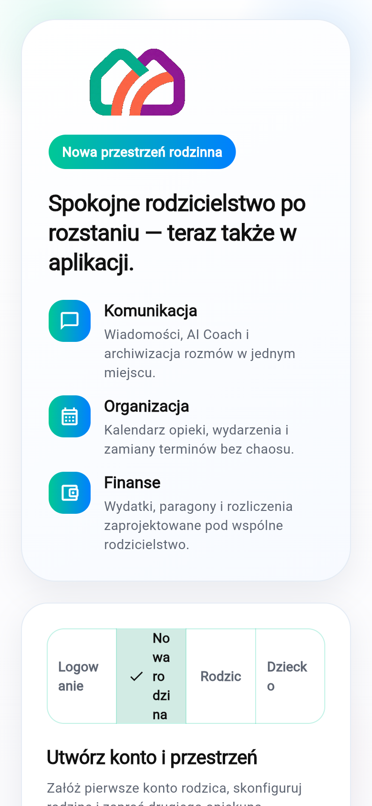
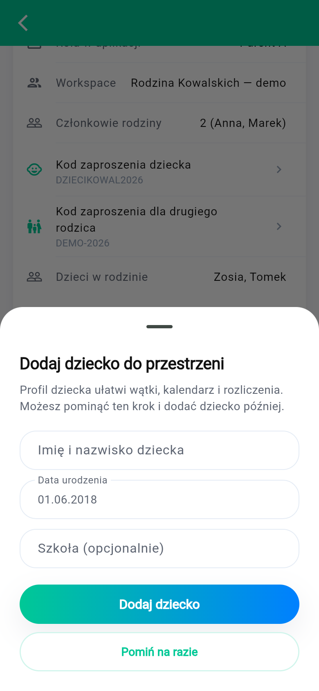
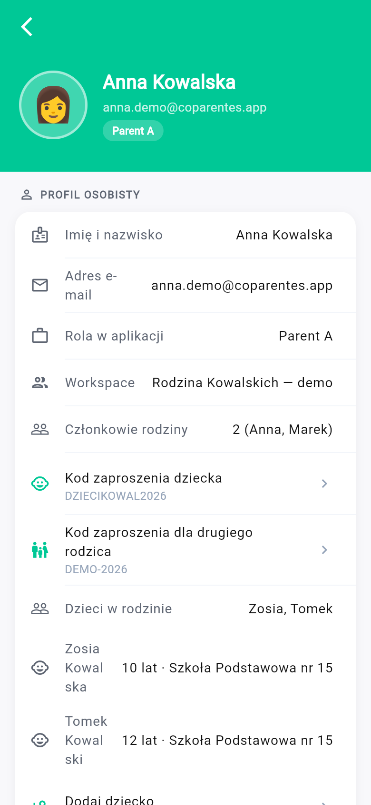
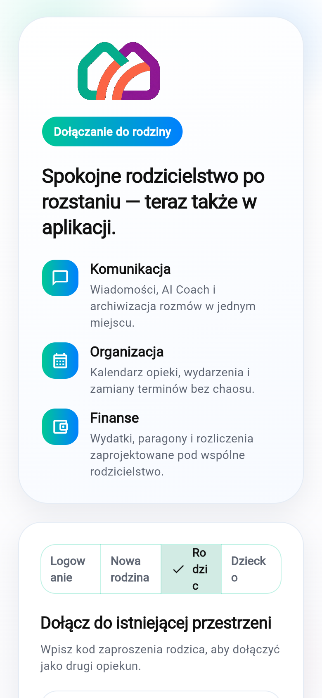
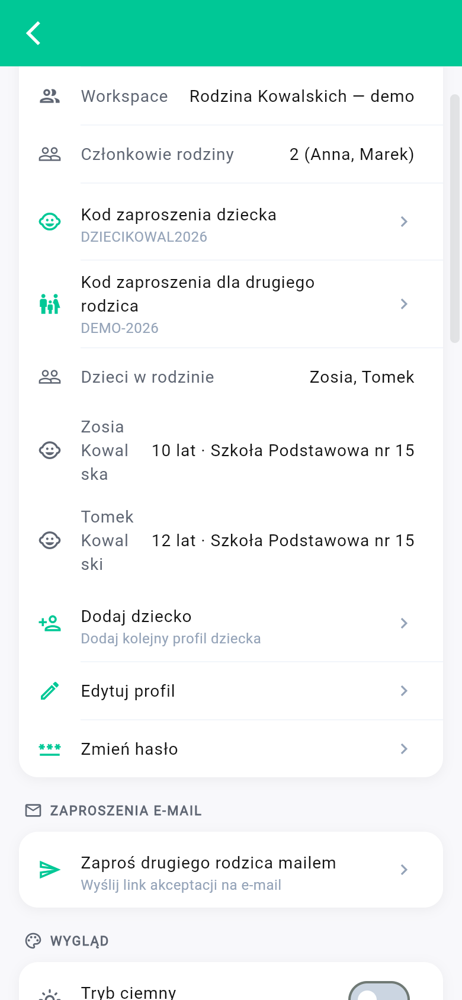
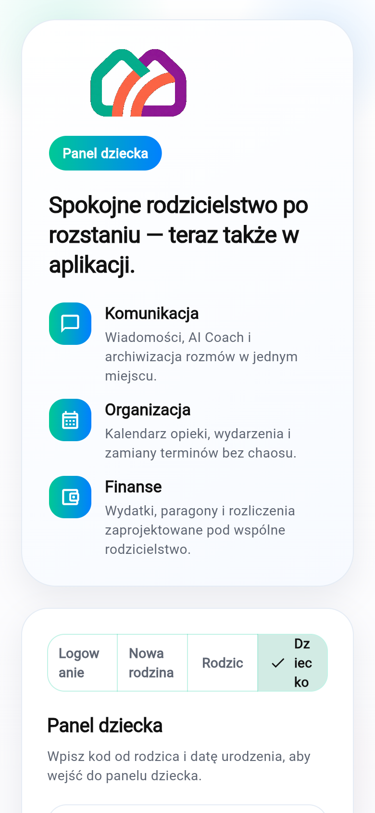

# Jak założyć nową rodzinę w Coparentes

Krótka instrukcja dla **pierwszego rodzica (Rodzic A)**: założenie konta, zaproszenie drugiego opiekuna, dodanie dzieci i logowanie dziecka do panelu.

Aplikacja: [getcoparentes.app](https://getcoparentes.app)

**Pobierz:** [PowerPoint (.pptx)](https://getcoparentes.app/downloads/instrukcja-nowa-rodzina.pptx) · [strona pobierania](https://getcoparentes.app/downloads/)

> Instrukcja dotyczy konta produkcyjnego (nie trybu demo). Hasło musi mieć **co najmniej 10 znaków**.

---

## Krok 1. Utwórz konto i przestrzeń rodzinną (Rodzic A)

1. Otwórz aplikację i wybierz zakładkę **Nowa rodzina**.
2. Wypełnij **imię i nazwisko**, **nazwę przestrzeni rodzinnej**, **e-mail** i **hasło**.
3. Kliknij **Utwórz konto**.



Po rejestracji zostaniesz zalogowany jako **Rodzic A** — osoba, która zakłada rodzinę i zarządza zaproszeniami.

---

## Krok 2. Dodaj pierwsze dziecko (opcjonalnie od razu)

Tuż po rejestracji może pojawić się okno **Dodaj dziecko do przestrzeni**. Możesz też dodać dziecko później w ustawieniach (krok 5).

1. Podaj **imię i nazwisko dziecka**.
2. Ustaw **datę urodzenia** — musi być zgodna z tą, którą dziecko poda przy logowaniu.
3. Szkoła jest opcjonalna.
4. Kliknij **Dodaj dziecko** albo **Pomiń na razie**.



---

## Krok 3. Zaproś drugiego rodzica

### Sposób A — kod zaproszenia (zalecany)

1. W panelu rodzica otwórz **ustawienia** (ikona zębatki przy awatarze).
2. W sekcji profilu znajdź **Kod zaproszenia dla drugiego rodzica**.
3. Dotknij wiersza — kod skopiuje się do schowka.
4. Wyślij kod partnerowi (SMS, WhatsApp, e-mail).



Na tym samym ekranie zobaczysz też **Kod zaproszenia dziecka** (potrzebny w kroku 6).

### Sposób B — zaproszenie e-mailem (opcjonalnie)

W ustawieniach, w sekcji **Zaproszenia e-mail**, wybierz **Zaproś drugiego rodzica mailem** i podaj adres partnera.


Partner musi **mieć już konto** Coparentes, aby zaakceptować zaproszenie. Przy pierwszym dołączeniu do rodziny wygodniejszy jest **kod z kroku 3A**.

---

## Krok 4. Drugi rodzic dołącza do rodziny

Drugiego rodzica prosisz, aby na własnym telefonie lub komputerze:

1. Otworzył [getcoparentes.app](https://getcoparentes.app).
2. Wybrał zakładkę **Rodzic** (nie „Nowa rodzina”).
3. Wpisał **imię i nazwisko**, **kod zaproszenia** od Ciebie, **własny e-mail** i **hasło**.
4. Kliknął **Dołącz**.



---

## Krok 5. Dodaj kolejne dzieci (Rodzic A)

1. Wejdź ponownie w **ustawienia**.
2. Dotknij **Dodaj dziecko** (lub **Dodaj kolejny profil dziecka**).
3. Uzupełnij dane tak samo jak w kroku 2.


Lista dzieci w rodzinie jest widoczna w ustawieniach pod wierszem **Dzieci w rodzinie**.

---

## Krok 6. Przekaż dziecku kod logowania

1. W ustawieniach (jako Rodzic A) skopiuj **Kod zaproszenia dziecka**.
2. Jeden kod obowiązuje dla całej rodziny — każde dziecko rozpoznawane jest po **dacie urodzenia** z profilu.



Przekaż kod dziecku bezpiecznym kanałem (ustnie, wiadomość od rodzica).

---

## Krok 7. Dziecko loguje się do panelu

Na telefonie lub tablecie dziecka:

1. Otwórz [getcoparentes.app](https://getcoparentes.app).
2. Wybierz zakładkę **Dziecko**.
3. Wpisz **kod zaproszenia dziecka** i kliknij **Sprawdź kod** — powinna pojawić się nazwa rodziny.
4. Ustaw **datę urodzenia** (tę samą, co w profilu u rodzica).
5. Ustaw **hasło** (min. 10 znaków).
6. Przy **pierwszym** logowaniu podaj **imię** — przy kolejnych logowaniach wystarczy kod, data urodzenia i hasło.
7. Kliknij **Wejdź**.



Po zalogowaniu dziecko widzi **panel dziecka** z zakładkami: **Dzisiaj**, **Kalendarz**, **Rodzina** i **Lista**.

---

## Typowe problemy

| Komunikat | Co zrobić |
|-----------|-----------|
| *Nie znaleziono profilu dziecka dla tej daty urodzenia* | Sprawdź datę urodzenia w profilu u Rodzica A albo poproś rodzica o dodanie profilu. |
| *Najpierw sprawdź kod zaproszenia dziecka* | Kliknij **Sprawdź kod** przed **Wejdź**. |
| *Nieprawidłowy kod zaproszenia* | Upewnij się, że używasz **kodu dziecka**, nie kodu dla drugiego rodzica. |
| Hasło za krótkie | Hasło musi mieć co najmniej **10 znaków**. |
| *Ten profil ma już konto* | Dziecko loguje się ponownie tym samym hasłem — imię nie jest już wymagane. |

---

## Podsumowanie ról

| Kto | Gdzie w aplikacji | Co robi |
|-----|-------------------|---------|
| **Rodzic A** | Nowa rodzina → ustawienia | Zakłada rodzinę, dodaje dzieci, udostępnia kody |
| **Rodzic B** | Rodzic | Dołącza kodem od Rodzica A |
| **Dziecko** | Dziecko | Loguje się kodem rodziny + datą urodzenia + hasłem |

---

## Odnawianie screenów (dla zespołu)

Screeny pochodzą z produkcji (`getcoparentes.app`, widok mobilny 390×844). Aby wygenerować je ponownie:

```bash
cd scripts
npm install
node capture-onboarding-screenshots.mjs
node capture-onboarding-inapp-screenshots.mjs
```

Wymagany: Google Chrome (macOS) lub ustaw `PUPPETEER_EXECUTABLE_PATH`.
